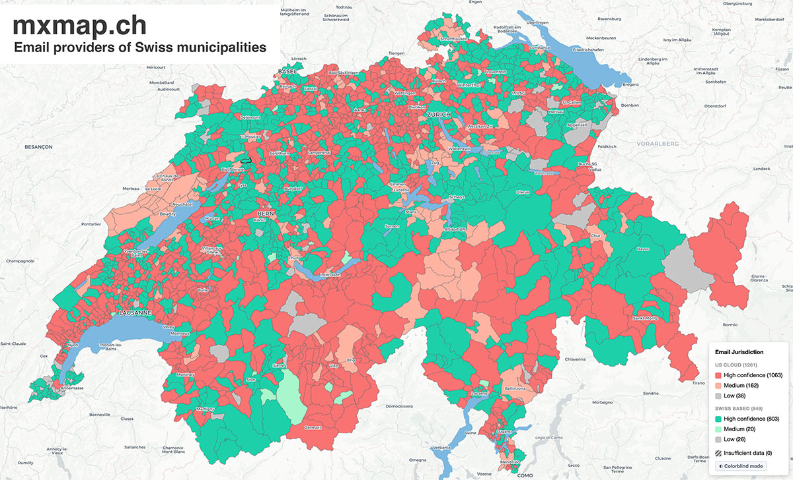
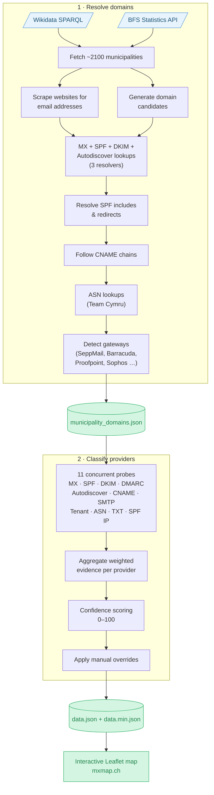

# MXmap — Email Providers of Swiss Municipalities

[](https://github.com/davidhuser/mxmap/actions/workflows/ci.yml)

An interactive map showing where Swiss municipalities host their email — whether with US hyperscalers (Microsoft, Google, AWS) or Swiss providers or other solutions.

**[View the live map](https://mxmap.ch)**

[](https://mxmap.ch)

## How it works

The data pipeline has two stages:

1. **Resolve domains** — Fetches all ~2100 Swiss municipalities from Wikidata and the BFS (Swiss Statistics) API, scrapes municipal websites for email addresses, performs DNS lookups (MX, SPF, DKIM, Autodiscover), resolves SPF includes/redirects, follows CNAME chains, runs ASN lookups, and detects mail gateways. Outputs `municipality_domains.json`.

2. **Classify providers** — For each resolved domain, runs 11 concurrent DNS fingerprinting probes. Aggregates weighted evidence, computes confidence scores (0–100), and applies manual overrides from `overrides.json`. Outputs `data.json` (full) and `data.min.json` (minified for the frontend).



## Classification system

Each domain is classified into one of six provider categories:

| Provider | Examples |
|---|---|
| **Microsoft 365** | `mail.protection.outlook.com`, `onmicrosoft.com` |
| **Google Workspace** | `aspmx.l.google.com`, `_spf.google.com` |
| **AWS** | `amazonaws.com`, `amazonses.com` |
| **Infomaniak** | `mxpool.infomaniak.com`, `spf.infomaniak.ch` |
| **Swiss ISP** | Swisscom, Sunrise, Init7, SWITCH, Hostpoint, and others (13 known ASNs) |
| **Independent** | Self-hosted or other providers |

Classification uses 11 weighted signal types collected as evidence:

| Signal | Weight | Source |
|---|---|---|
| MX | 0.20 | MX record hostnames |
| SPF | 0.20 | SPF `include:` directives |
| DKIM | 0.15 | DKIM selector CNAME targets |
| Tenant | 0.10 | Microsoft 365 tenant detection |
| SPF IP | 0.08 | IP addresses in SPF records |
| Autodiscover | 0.08 | Autodiscover CNAME/SRV records |
| TXT verification | 0.07 | TXT verification records (e.g. `ms=ms`) |
| SMTP | 0.04 | SMTP banner on port 25 |
| CNAME chain | 0.03 | MX host CNAME resolution |
| ASN | 0.03 | ASN ownership (Team Cymru) |
| DMARC | 0.02 | DMARC TXT record patterns |

Confidence is computed as `vote_share * depth_factor` on a 0–100 scale. Some signals (Tenant, TXT verification, ASN, SPF IP) are confirmation-only — they can reinforce but not establish a classification.

Mail gateways (SeppMail, Barracuda, Proofpoint, Sophos, etc.) are detected and reported separately.

## Quick start

```bash
uv sync

# Stage 1: resolve municipality domains
uv run resolve-domains

# Stage 2: classify email providers
uv run classify-providers

# Serve the map locally
python -m http.server
```

## Development

```bash
uv sync --group dev

# Run tests (90% coverage threshold enforced)
uv run pytest --cov --cov-report=term-missing

# Lint & format
uv run ruff check src tests
uv run ruff format src tests
```

## Project structure

```
src/mail_sovereignty/
├── cli.py             # CLI entry points (resolve-domains, classify-providers)
├── resolve.py         # Stage 1: domain resolution pipeline
├── pipeline.py        # Stage 2: classification orchestration
├── classifier.py      # Evidence aggregation and confidence scoring
├── probes.py          # 11 async DNS probe functions
├── signatures.py      # Provider fingerprint patterns and ASN mappings
├── models.py          # Pydantic models (Provider, SignalKind, Evidence, …)
├── dns.py             # DNS resolver setup and MX lookups
├── bfs_api.py         # BFS (Swiss Statistics) API client
├── constants.py       # Wikidata SPARQL query, skip domains, canton mappings
└── log.py             # Logging setup (loguru)

tests/                 # 13 test modules, pytest + pytest-asyncio

index.html             # Frontend SPA (Leaflet map + TopoJSON boundaries)
impressum.html         # Legal impressum
datenschutz.html       # Privacy policy
```

## Data files

| File                        | Description                                                         |
|-----------------------------|---------------------------------------------------------------------|
| `municipality_domains.json` | Intermediate output from Stage 1 — domains, MX/SPF records, sources |
| `data.json`                 | Final classifications with full evidence and confidence scores      |
| `data.min.json`             | Minified version served to the frontend                             |
| `overrides.json`            | Manual classification corrections for edge cases                    |
| `mxmap.log`                 | Pipeline log files (might be outdated)                              |


## Related work

* [hpr4379 :: Mapping Municipalities' Digital Dependencies](https://hackerpublicradio.org/eps/hpr4379/index.html)
* If you know of other similar projects, please open an issue or submit a PR to add them here!

## Contributing

If you spot a misclassification, please open an issue with the BFS number and the correct provider.
For municipalities where automated detection fails, corrections can be added to [`overrides.json`](overrides.json).

## Licence

[MIT](LICENCE)
